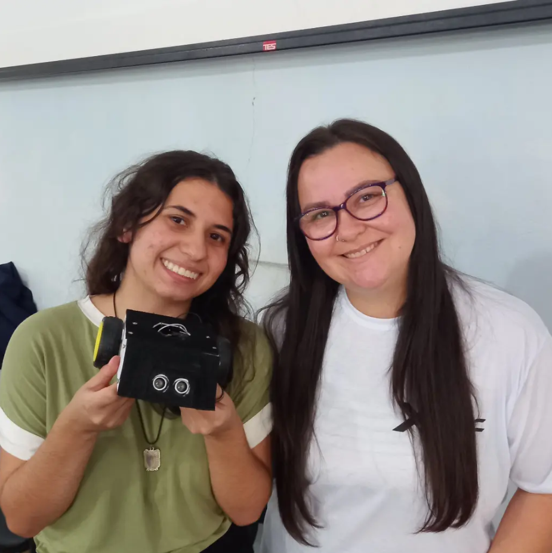

# Torneio de Robótica — IFMG Campus Bambuí

Repositório com os códigos desenvolvidos para o robô utilizado no **Torneio de Robótica do IFMG – Campus Bambuí**.

O projeto foi desenvolvido em dupla e teve como objetivo programar o comportamento autônomo do robô durante a competição. O robô utilizava sensores para identificar o adversário e as bordas da arena, além de motores controlados por diferentes velocidades para realizar movimentos de busca, ataque e retorno à arena.

<p align="center">
  
</p>

## Resultado

O projeto conquistou o **1º lugar no Torneio de Robótica do IFMG – Campus Bambuí**.

## Funcionamento

O código implementa uma estratégia de funcionamento baseada em três comportamentos principais:

* **Busca:** o robô alterna entre giros para a esquerda e para a direita enquanto procura pelo adversário.
* **Ataque:** ao detectar o adversário a uma distância de até 40 cm, o robô avança em direção a ele.
* **Proteção contra a borda:** os sensores infravermelhos identificam a borda da arena. Quando detectada, o robô dá ré e realiza um giro para retornar ao interior da arena.

Antes do início da movimentação, o robô permanece parado durante **5 segundos**, permitindo o posicionamento inicial para a competição.

## Sensores e componentes

### Sensor ultrassônico

Utilizado para detectar a distância até o adversário.

* Trigger: pino 4
* Echo: pino 2
* Distância máxima para iniciar o ataque: 40 cm

### Sensores infravermelhos

Utilizados para detectar a borda da arena.

* Sensor esquerdo: pino 11
* Sensor direito: pino 3

### Motores

O controle dos motores é realizado por meio de sinais digitais e PWM, permitindo controlar tanto o sentido de rotação quanto a velocidade.

## Controle de velocidade

O código utiliza três níveis de velocidade:

```cpp
#define BUSCA_SPEED 160
#define ATAQUE_SPEED 200
#define FINAL_SPEED 220
```

* **160:** velocidade utilizada durante a busca pelo adversário.
* **200:** velocidade utilizada durante o ataque.
* **220:** velocidade utilizada para manobras de emergência, como ré e retorno após detectar a borda.

## Lógica do robô

De forma simplificada, o funcionamento segue esta prioridade:

1. Aguarda 5 segundos antes de iniciar.
2. Verifica se uma borda da arena foi detectada.
3. Caso a borda seja detectada, interrompe o ataque, dá ré e gira para retornar à arena.
4. Caso não haja borda, verifica a distância até o adversário.
5. Se o adversário estiver a até 40 cm, inicia o ataque.
6. Caso o adversário não seja encontrado, realiza movimentos de busca alternando entre esquerda e direita.

A detecção da borda possui **prioridade sobre o ataque**, evitando que o robô continue avançando quando estiver próximo ao limite da arena.

## Tecnologias

* Arduino
* C/C++
* Sensor ultrassônico
* Sensores infravermelhos
* Motores DC

## Estrutura do repositório

Os arquivos deste repositório incluem o código principal utilizado no robô e arquivos desenvolvidos durante os testes e preparação para a competição.

## Equipe

- Fabíola Faria
- Maria Eduarda Saldanha Alves
